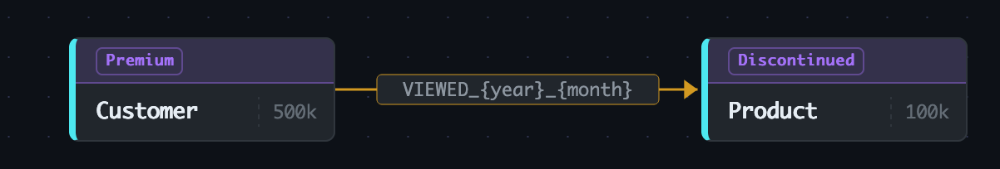
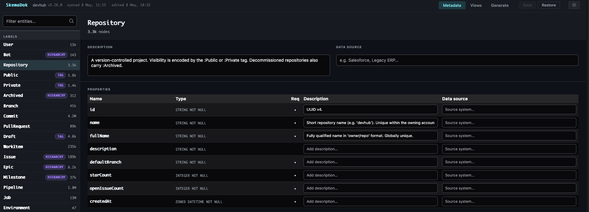
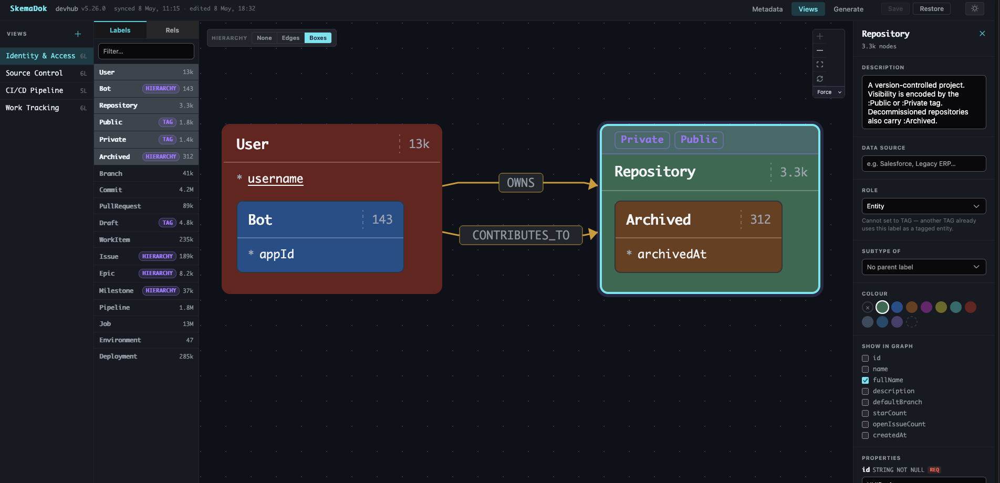
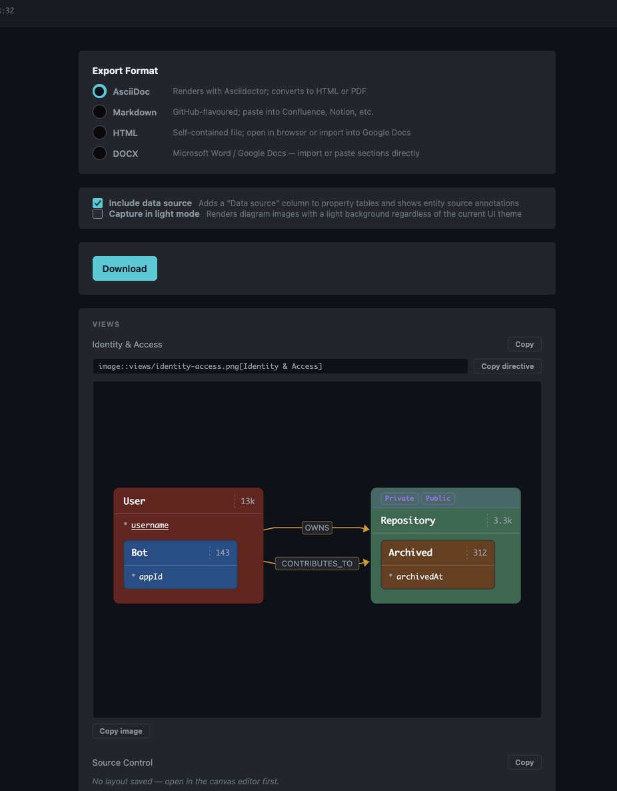

# SkemaDok

Neo4j schema analyser and documentation builder.

SkemaDok captures the schema of a live Neo4j database as a portable JSON file, lets you annotate it through a
browser-based editor, and generates documentation in AsciiDoc, Markdown, HTML, or DOCX — complete with diagram images.

The `schema.json` file is plain, human-readable JSON. Customers can review exactly what they are sharing before handing
it over.

This repository contains a `schema-demo.json` to experiment with the UI and generation. This file was used for the
screenshots in this readme.

---

## How it works

Use the skemadok-collector jar to connect to a Neo4j instance and collect schema information in a JSON file. This
process only needs read access and the collector only uses read-transactions, minimising the risk for the database.

The JSON file can then be transported of potentially sensitive environment and annotated with the SkemaDok UI. The UI
allows to enrich the file with manual documentation of labels, relations and properties. It also allows you to define '
Views' which capture all or a subset of the graph. This way, large models can be split up and discussed without
overwhelming.

All this additional information is stored inside the JSON file.

The UI also allows to generate and export the documentation in the following formats:

* AsciiDoc
* Markdown
* HTML
* docx

There is also the option to generate the documentation via cli, but since the browser is needed to render the images (
views), this is of limited use.

## Steps:

**Customer step** — the customer runs a small collector JAR (~10 MB) against their database, which writes the schema to
`schema.json`. Nothing is sent anywhere automatically; the customer reviews the file and sends it to you.

**Annotation step** — you open `schema.json` in the SkemaDok UI, describe entities and properties, and arrange them into
named views on a graph canvas.

**Generation step** — the UI or the CLI bundles the annotated schema and the canvas diagrams into a documentation
package.

---

## Collecting the schema

Download `skemadok-collector-{version}-exec.jar` and give it to the customer, or run it yourself if you have direct
access:

```bash
java -jar skemadok-collector-0.1.0-SNAPSHOT-exec.jar collect \
  --uri bolt://localhost:7687 \
  --username neo4j \
  --password \
  --output schema.json
```

`--password` without a value prompts interactively — the password never appears in shell history.

The collector uses only read operations and native Neo4j procedures (`CALL db.schema.*`, `SHOW INDEXES`,
`SHOW CONSTRAINTS`). No APOC, no writes.

### Creating a read-only user

In a production environment, it is recommended to create (or use an existing) read-only database user.

```cypher
CREATE USER skemadok SET PASSWORD 'change-me' CHANGE NOT REQUIRED;
GRANT ROLE reader TO skemadok;

-- SHOW INDEXES and SHOW CONSTRAINTS require an additional privilege in Neo4j 5.x
GRANT SHOW INDEX ON DATABASE * TO reader;
GRANT SHOW CONSTRAINT ON DATABASE * TO reader;
```

## Collected data

* Labels and their counts
* Co-Labels
* Relationships
* Start and End labels per relationship and the count of these pairs
* Properties and their types per label and relationship
* Constraints
* Indexes, including usage counts

In addition, a heuristic is used to group relationships for those data models that use variable parts in the
relationship types.
`REL_2026_04`, `REL_2026_05`. The user can later rename the generic `v1` placeholder to something meaningful.
See picture below as an example.



## Annotating the schema

If you have access to the software that writes to Neo4j, you can use an LLM to perform parts of the annotation
automatically. The docs/annotate-schema-prompt.md contains instructions for an agent to do so.

```bash
java -jar skemadok-0.1.0-SNAPSHOT.jar ui --schema schema.json
```

Open `http://localhost:8282` in a browser. The UI has three sections.

### Metadata

Browse every node label and relationship type. For each entity you can write a description, add a data-source note. The
same for each property.



### Views

Arrange labels on a canvas to create named, focused diagrams of the schema. Drag labels from the picker onto the canvas;
relationship edges between visible labels appear automatically. Annotate nodes in the side panel. Add a free-form
description to the view.



#### Tags

Labels with the `TAG` role (such as `Private` and `Public` in the screenshot) appear as chips inside their tagged node
rather than as standalone nodes. Tags classify entities without adding properties of their own — they stay visible but
out of the way. Think: labels added for RBAC controls.

#### Hierarchy

When labels extend a parent (e.g. `Bot` extending `User`), switch the canvas to **Boxes** mode. Child nodes render
inside the parent's bounding box, with the parent's own properties visible in the box header.
Used when child labels provide additional properties to their parent label nodes.

Three hierarchy display modes are available from the canvas toolbar:

| Mode  | What you see                                                  |
|-------|---------------------------------------------------------------|
| None  | Every label as a flat node; no inheritance shown              |
| Edges | Dashed arrows from child to parent (UML generalisation style) |
| Boxes | Child nodes nested inside the parent's bounding box           |

### Generate

Select an output format, preview each view's diagram, and download the documentation package.



| Format   | Notes                                                           |
|----------|-----------------------------------------------------------------|
| AsciiDoc | Renders with Asciidoctor; converts to HTML or PDF               |
| Markdown | GitHub-flavoured; paste into Confluence, Notion, etc.           |
| HTML     | Self-contained file; open in browser or import into Google Docs |
| DOCX     | Microsoft Word / Google Docs                                    |

AsciiDoc and Markdown downloads are a zip file containing the document and a `views/` folder of PNG diagrams. HTML and
DOCX are single self-contained files.

The generate page also provides copy buttons if only a subset of the documentation is needed.

---

## Schema drift and merging

Data models change. When the customer sends a fresh snapshot after the model has evolved, merge it into your
already-annotated file rather than starting over:

```bash
java -jar skemadok-0.1.0-SNAPSHOT.jar merge \
  annotated-schema.json new-snapshot.json
```

The merger adds new labels and relationship types, updates structural data (counts, property types, connectivity), and
leaves all annotations untouched. Labels that have disappeared from the database are flagged `"removed": true` rather
than deleted — their descriptions, colours, and canvas positions survive and come back automatically if the label
reappears later.

---

## Generating documentation from the command line

The full app JAR can also generate documentation without starting a web server (diagram images are not included in this
mode):

```bash
java -jar skemadok-0.1.0-SNAPSHOT.jar generate \
  --schema schema.json --format asciidoc --output schema-doc.adoc

java -jar skemadok-0.1.0-SNAPSHOT.jar generate \
  --schema schema.json --format markdown --output schema-doc.md

java -jar skemadok-0.1.0-SNAPSHOT.jar generate \
  --schema schema.json --format html --output schema-doc.html

java -jar skemadok-0.1.0-SNAPSHOT.jar generate \
  --schema schema.json --format docx --output schema-doc.docx
```

The **Download** button in the UI does the same and also captures diagram images from the canvas.

---

## Rebuilding a database from a schema file

Sometimes a customer can only afford to run the collector once — on a slow QUAL system, or against a database whose
collection time is measured in hours. The `seed` subcommand reverses the artefact: given a captured `schema.json`, it
materialises a Neo4j database with matching topology so you can iterate locally without going back to the source system.

```bash
java -jar skemadok-0.1.0-SNAPSHOT.jar seed schema.json \
  --uri bolt://localhost:7687 --username neo4j --password \
  --scale 0.001 --drop
```

What is preserved:

- All node labels and relationship types declared in the document
- Per-label node counts (multiplied by `--scale`)
- Per-connection relationship counts (multiplied by `--scale`, capped at the scaled endpoint product)
- Constraints (UNIQUENESS, NODE KEY, RELATIONSHIP KEY, IS NOT NULL) and RANGE indexes
- Parameterised relationship type instances (`PROMOTED_2024_Q1`, `PROMOTED_2024_Q2`, …) are materialised individually
  with the group count split evenly across them

What is not preserved:

- Property values are placeholders (`<Label>_<index>` for `id`, type-appropriate stubs for everything else). The data
  shape is faithful; the data itself is not.
- Multi-label nodes are flattened — each label gets its own disjoint pool, and multi-label `Connection` rows use the
  alphabetically-first label on each side.
- Per-source fan-out is uniform random; degree distributions from the source database are not reproduced.
- VECTOR, FULLTEXT, TEXT, and POINT indexes — these have bespoke `CREATE INDEX` syntax that the seeder does not yet
  generate; they are silently omitted.

Use `--dry-run` to print the scaled targets without writing anything, `--scale 10` to inflate beyond the captured counts
for stress-testing, and `--skip-indexes` to omit non-key indexes at high scales where index population dominates wall
time.

This subcommand is intentionally shipped only in the full app JAR — it is not part of the customer-facing collector
distribution.

---

## Bulk-loading a database from a schema file

When `seed` is too slow — for example at scales above 1 million nodes where the per-batch Bolt round-trips dominate
wall time — use `seed-bulk` instead. It writes Parquet files to disk and lets `neo4j-admin database import full` do the
heavy lifting. No live database connection is required during the export step.

```bash
java -jar skemadok-0.1.0-SNAPSHOT.jar seed-bulk schema.json \
  --scale 10 --output-dir ./neo4j-import
```

Two ready-to-run shell scripts are written into the output directory alongside the Parquet files:

- `import.sh` — standalone `neo4j-admin` install; uses `$IMPORT_DIR/nodes/*.parquet` wildcards
- `import-docker.sh` — `docker exec` into a running Neo4j container; the container must have the import
  directory mounted at `/import`

Both scripts declare all configuration variables at the top (`DATABASE`, `IMPORT_DIR`, `CONTAINER`) so a
single edit covers the whole file.

A wildcard quick-reference is also printed to the terminal:

```
neo4j-admin database import full \
  --nodes=./neo4j-import/nodes/*.parquet \
  --relationships=./neo4j-import/relationships/*.parquet \
  --database=neo4j \
  --overwrite-destination
```

Use `--database` to customise the database name written into the scripts.

Use `--dry-run` to print the scaled plan without writing anything. The same scale and topology caveats that apply to
`seed` apply here — property values are placeholders, degree distributions are uniform random.

---

## Two JARs

| JAR                                     | Size   | Purpose                                                       |
|-----------------------------------------|--------|---------------------------------------------------------------|
| `skemadok-collector-{version}-exec.jar` | ~10 MB | Schema capture only; give this to customers                   |
| `skemadok-{version}.jar`                | ~48 MB | Full app: capture, merge, UI, annotation, generation, seeding |

---

## Building from source

Java 21+ is required.

```bash
# Full build — installs Node 20, builds Vue app, packages both JARs
mvn package -DskipTests

# With tests (requires Docker for Testcontainers)
mvn verify
```

Output:

- `collector/target/skemadok-collector-0.1.0-SNAPSHOT-exec.jar`
- `app/target/skemadok-0.1.0-SNAPSHOT.jar`

Frontend dev server (proxies `/api` to Spring on `:8282`):

```bash
cd app/src/main/frontend
npm install
npm run dev        # Vite on :5173
```

